# Architecture Overview

This document provides a comprehensive overview of Fiction CMS's architecture, design decisions, and technical implementation details for maintainers and developers.

## System Architecture

Fiction CMS follows a modern full-stack architecture with clear separation of concerns:

```
┌─────────────────────────────────────────────────────────────┐
│                    Frontend (React + TypeScript)           │
│  ┌─────────────┐ ┌─────────────┐ ┌─────────────────────┐   │
│  │    Pages    │ │ Components  │ │   Monaco Editor     │   │
│  │             │ │             │ │   Integration       │   │
│  └─────────────┘ └─────────────┘ └─────────────────────┘   │
└─────────────────────────────────────────────────────────────┘
                              │ HTTP/WebSocket
                              │
┌─────────────────────────────────────────────────────────────┐
│                 Backend (Hono.js + TypeScript)             │
│  ┌─────────────┐ ┌─────────────┐ ┌─────────────────────┐   │
│  │ Auth System │ │ API Routes  │ │   CMS Engine        │   │
│  │  (PASETO)   │ │             │ │                     │   │
│  └─────────────┘ └─────────────┘ └─────────────────────┘   │
└─────────────────────────────────────────────────────────────┘
                              │
               ┌──────────────┼──────────────┐
               │              │              │
┌─────────────────┐ ┌─────────────────┐ ┌─────────────────┐
│   SQLite DB     │ │  Git Repos      │ │  GitHub API     │
│ (User/Role      │ │ (Content        │ │  (Repository    │
│  Management)    │ │  Storage)       │ │   Operations)   │
└─────────────────┘ └─────────────────┘ └─────────────────┘
```

## Core Design Principles

### 1. Git-Native Content Management

Fiction CMS treats Git repositories as the single source of truth for content, implementing a "Git-native" approach:

- **Content as Code**: All content lives in Git repositories alongside the site code
- **Version Control**: Every change is tracked through Git commits
- **Atomic Operations**: File changes are committed as atomic transactions
- **Conflict Resolution**: Git's merge capabilities handle concurrent edits

### 2. Hybrid Architecture Pattern

The system bridges two architectural paradigms:

- **API-Driven User Management**: Traditional database-backed user authentication and authorization
- **File-Based Content Storage**: Git repositories serve as the content database

This hybrid approach provides the benefits of both patterns while mitigating their individual weaknesses.

### 3. Modular Engine Design

The CMS engine is designed as a collection of specialized managers:

```typescript
interface EngineArchitecture {
  contentManager: {
    text: TextManager;      // Markdown, JSON files
    sqlite: SQLiteManager; // Database file operations
    asset: AssetManager;    // Binary file handling
    common: CommonManager;  // Shared utilities
  };
  gitManager: GitManager;         // Git operations
  deploymentEngine: DeploymentEngine; // Build and deploy
}
```

## Frontend Architecture

### Component Hierarchy

```
App
├── AuthProvider (Authentication context)
├── Router
│   ├── AuthGuard (Protected routes)
│   ├── DashboardPage
│   ├── SitesPage
│   │   ├── SiteList
│   │   ├── SiteCard
│   │   └── CreateSiteModal
│   ├── SiteManagePage
│   │   ├── FileExplorer
│   │   ├── ContentEditor
│   │   │   ├── MarkdownEditor
│   │   │   ├── JSONEditor
│   │   │   └── CodeEditor
│   │   └── PreviewPanel
│   └── SettingsPage
└── GlobalErrorBoundary
```

### State Management Strategy

Fiction CMS uses a combination of state management approaches:

- **React Context**: Authentication state, user preferences
- **Local Component State**: UI state, form data
- **Custom Hooks**: API integration, file operations
- **URL State**: Navigation, filtering, search

### Editor Integration

The Monaco Editor integration provides VS Code-like editing capabilities:

```typescript
interface EditorIntegration {
  languages: ['markdown', 'json', 'javascript', 'typescript', 'css', 'html', 'sql'];
  features: ['syntax-highlighting', 'autocomplete', 'error-checking', 'find-replace'];
  themes: ['light', 'dark', 'high-contrast'];
  validation: {
    json: 'real-time-parsing',
    markdown: 'live-preview',
    sql: 'syntax-validation'
  };
}
```

## Backend Architecture

### API Layer (Hono.js)

Hono.js provides a fast, lightweight API framework with excellent TypeScript support:

```typescript
// Route structure
app.route('/api/auth', authRoutes);
app.route('/api/users', userRoutes);
app.route('/api/roles', roleRoutes);
app.route('/api/sites', siteRoutes);
app.route('/api/engine', engineRoutes);
```

### Middleware Stack

1. **CORS Handler**: Cross-origin request management
2. **Authentication Middleware**: Token validation and user context
3. **Authorization Middleware**: Role-based access control
4. **Validation Middleware**: Request/response validation using Zod
5. **Error Handler**: Centralized error processing
6. **Logging Middleware**: Request/response logging

### Authentication System

Fiction CMS implements PASETO v4 for authentication:

```typescript
interface AuthenticationFlow {
  login: {
    input: { username: string; password: string };
    process: [
      'validate-credentials',
      'generate-paseto-token',
      'set-user-context',
      'return-token'
    ];
    output: { token: string; user: User; expiresIn: number };
  };
  
  middleware: {
    validateToken: 'extract-and-verify-paseto';
    checkPermissions: 'role-based-access-control';
  };
}
```

### Database Schema

SQLite database handles user management and system configuration:

```sql
-- Core user management tables
CREATE TABLE users (
  id INTEGER PRIMARY KEY,
  username TEXT UNIQUE NOT NULL,
  email TEXT UNIQUE,
  password_hash TEXT NOT NULL,
  created_at TIMESTAMP DEFAULT CURRENT_TIMESTAMP,
  updated_at TIMESTAMP DEFAULT CURRENT_TIMESTAMP
);

CREATE TABLE roles (
  id INTEGER PRIMARY KEY,
  name TEXT UNIQUE NOT NULL,
  description TEXT,
  permissions TEXT -- JSON array
);

CREATE TABLE user_roles (
  user_id INTEGER REFERENCES users(id),
  role_id INTEGER REFERENCES roles(id),
  PRIMARY KEY (user_id, role_id)
);

CREATE TABLE sites (
  id INTEGER PRIMARY KEY,
  name TEXT NOT NULL,
  repository_url TEXT NOT NULL,
  local_path TEXT NOT NULL,
  config TEXT, -- JSON site configuration
  created_by INTEGER REFERENCES users(id),
  created_at TIMESTAMP DEFAULT CURRENT_TIMESTAMP
);

CREATE TABLE site_permissions (
  user_id INTEGER REFERENCES users(id),
  site_id INTEGER REFERENCES sites(id),
  permissions TEXT, -- JSON permissions array
  PRIMARY KEY (user_id, site_id)
);
```

## CMS Engine Architecture

### Content Manager Design

The Content Manager provides unified interfaces for different file types:

```typescript
interface ContentManagerArchitecture {
  // Unified interface for all content operations
  readFile(siteConfig: SiteConfig, path: string): Promise<ContentResult>;
  writeFile(siteConfig: SiteConfig, path: string, content: string): Promise<OperationResult>;
  deleteFile(siteConfig: SiteConfig, path: string): Promise<OperationResult>;
  
  // Specialized managers for different content types
  text: {
    readMarkdown(path: string): Promise<MarkdownResult>;
    writeMarkdown(path: string, content: string): Promise<OperationResult>;
    readJSON(path: string): Promise<JSONResult>;
    writeJSON(path: string, data: any): Promise<OperationResult>;
  };
  
  sqlite: {
    getTables(dbPath: string): Promise<TableInfo[]>;
    getTableData(dbPath: string, table: string): Promise<RowData[]>;
    insertRow(dbPath: string, table: string, data: Record<string, any>): Promise<OperationResult>;
    updateRow(dbPath: string, table: string, id: number, data: Record<string, any>): Promise<OperationResult>;
  };
  
  asset: {
    uploadFile(path: string, buffer: Buffer): Promise<OperationResult>;
    getFileInfo(path: string): Promise<AssetInfo>;
    deleteAsset(path: string): Promise<OperationResult>;
  };
}
```

### Git Manager Integration

Git operations are abstracted through a dedicated Git Manager:

```typescript
interface GitManagerCapabilities {
  repository: {
    initialize(siteConfig: SiteConfig): Promise<void>;
    clone(url: string, localPath: string, token: string): Promise<void>;
    pull(siteConfig: SiteConfig): Promise<PullResult>;
    push(siteConfig: SiteConfig): Promise<PushResult>;
  };
  
  commits: {
    commit(siteConfig: SiteConfig, message: string, author: Author): Promise<CommitResult>;
    getHistory(siteConfig: SiteConfig, limit?: number): Promise<CommitInfo[]>;
  };
  
  branches: {
    getCurrentBranch(siteConfig: SiteConfig): Promise<string>;
    createBranch(siteConfig: SiteConfig, name: string): Promise<void>;
    switchBranch(siteConfig: SiteConfig, name: string): Promise<void>;
  };
}
```

### Deployment Engine

The deployment engine manages build and deploy processes:

```typescript
interface DeploymentEngineArchitecture {
  builds: {
    executeCommand(siteConfig: SiteConfig, command: string): Promise<BuildResult>;
    watchBuildProcess(siteConfig: SiteConfig): AsyncIterator<BuildStatus>;
  };
  
  deployment: {
    deployToGitHubPages(siteConfig: SiteConfig): Promise<DeployResult>;
    getDeploymentStatus(siteConfig: SiteConfig, taskId: string): Promise<DeployStatus>;
  };
  
  monitoring: {
    getBuildLogs(siteConfig: SiteConfig, buildId: string): Promise<string>;
    getDeploymentHistory(siteConfig: SiteConfig): Promise<DeploymentInfo[]>;
  };
}
```

## Security Architecture

### Authentication Flow

```mermaid
sequenceDiagram
    participant Client
    participant Backend
    participant Database
    
    Client->>Backend: POST /api/auth/login
    Backend->>Database: Verify credentials
    Database-->>Backend: User data
    Backend->>Backend: Generate PASETO token
    Backend-->>Client: Token + User info
    
    Note over Client: Store token in localStorage
    
    Client->>Backend: API requests with token
    Backend->>Backend: Validate PASETO token
    Backend->>Database: Check permissions
    Database-->>Backend: Permission data
    Backend-->>Client: Authorized response
```



### Permission System

Role-based access control (RBAC) with granular permissions:

```typescript
interface PermissionSystem {
  roles: {
    admin: ['all-permissions'];
    editor: ['site:read', 'site:write', 'content:read', 'content:write'];
    viewer: ['site:read', 'content:read'];
  };
  
  sitePermissions: {
    'site:read': 'View site information';
    'site:write': 'Modify site settings';
    'site:delete': 'Delete sites';
    'content:read': 'View file contents';
    'content:write': 'Modify file contents';
    'content:delete': 'Delete files';
    'deploy:trigger': 'Trigger deployments';
  };
}
```

### Security Measures

1. **Token Security**: PASETO v4 with ed25519 signatures
2. **Password Security**: bcrypt hashing with salt rounds
3. **Input Validation**: Zod schemas for all inputs
4. **Path Validation**: Prevent directory traversal attacks
5. **CORS Configuration**: Restrict allowed origins
6. **Rate Limiting**: Prevent abuse of API endpoints

## Performance Considerations

### Frontend Optimizations

- **Code Splitting**: Route-based code splitting with React.lazy
- **Lazy Loading**: On-demand loading of large components (Monaco Editor)
- **Memoization**: React.memo and useMemo for expensive calculations
- **Virtual Scrolling**: For large file lists and data tables

### Backend Optimizations

- **Database Indexing**: Proper indexes on frequently queried columns
- **Connection Pooling**: SQLite connection management
- **Caching Strategy**: In-memory caching for frequently accessed data
- **Streaming Responses**: Large file operations use streaming

### Git Operations

- **Shallow Clones**: Minimize repository size for initial clones
- **Incremental Operations**: Pull only changed files when possible
- **Background Processing**: Long-running git operations in background tasks

## Scalability Considerations

### Horizontal Scaling

- **Stateless Design**: No server-side session storage
- **Database Sharding**: User-based sharding for multi-tenant scenarios
- **Load Balancing**: Support for multiple backend instances

### Resource Management

- **Memory Usage**: Efficient Git operations and file handling
- **Disk Space**: Automatic cleanup of temporary files and old repositories
- **CPU Usage**: Background job queuing for intensive operations

## Development Patterns

### Error Handling

Consistent error handling across all layers:

```typescript
interface ErrorHandlingPattern {
  apiLayer: {
    try: 'business-logic';
    catch: 'log-error-and-return-user-friendly-message';
  };
  
  engineLayer: {
    return: 'Result<T, Error>' | 'OperationResult';
    never: 'throw-exceptions-directly';
  };
  
  clientLayer: {
    handle: 'api-errors-with-user-feedback';
    retry: 'transient-network-errors';
  };
}
```

### Testing Strategy

- **Unit Tests**: Core business logic and utilities
- **Integration Tests**: API endpoints and database operations
- **Component Tests**: React components with testing-library
- **E2E Tests**: Critical user flows with Playwright

## Migration and Versioning

### Database Migrations

```typescript
interface MigrationSystem {
  versioning: 'semantic-versioning';
  migrations: {
    structure: 'up-and-down-migrations';
    execution: 'automatic-on-startup';
    rollback: 'manual-rollback-support';
  };
}
```

### API Versioning

- **URL Versioning**: `/api/v1/`, `/api/v2/` for breaking changes
- **Backward Compatibility**: Maintain previous version support
- **Deprecation Strategy**: Clear timeline for API deprecation

---

This architecture overview serves as the foundation for understanding Fiction CMS's technical implementation and guides future development decisions.
