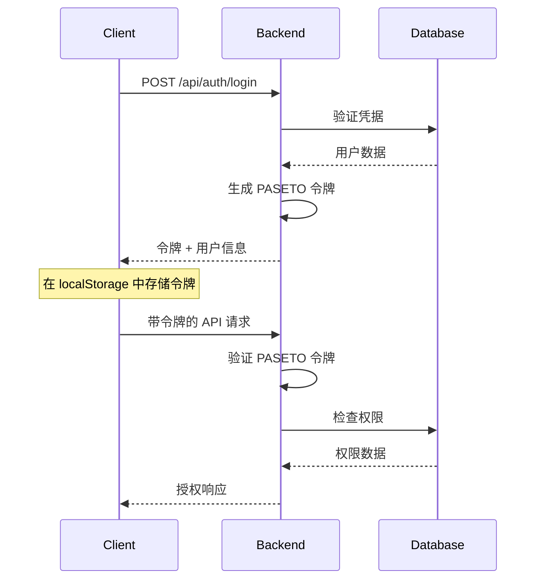

# 架构概览

本文档为维护者和开发者提供 Fiction CMS 架构、设计决策和技术实现细节的全面概述。

## 系统架构

Fiction CMS 采用现代全栈架构，具有清晰的关注点分离：

```
┌─────────────────────────────────────────────────────────────┐
│                   前端 (React + TypeScript)                │
│  ┌─────────────┐ ┌─────────────┐ ┌─────────────────────┐   │
│  │    页面     │ │    组件     │ │   Monaco Editor     │   │
│  │             │ │             │ │      集成           │   │
│  └─────────────┘ └─────────────┘ └─────────────────────┘   │
└─────────────────────────────────────────────────────────────┘
                              │ HTTP/WebSocket
                              │
┌─────────────────────────────────────────────────────────────┐
│                后端 (Hono.js + TypeScript)                 │
│  ┌─────────────┐ ┌─────────────┐ ┌─────────────────────┐   │
│  │  认证系统   │ │ API 路由    │ │   CMS 引擎          │   │
│  │  (PASETO)   │ │             │ │                     │   │
│  └─────────────┘ └─────────────┘ └─────────────────────┘   │
└─────────────────────────────────────────────────────────────┘
                              │
               ┌──────────────┼──────────────┐
               │              │              │
┌─────────────────┐ ┌─────────────────┐ ┌─────────────────┐
│   SQLite DB     │ │  Git 仓库       │ │  GitHub API     │
│ (用户/角色      │ │ (内容           │ │  (仓库          │
│  管理)          │ │  存储)          │ │   操作)         │
└─────────────────┘ └─────────────────┘ └─────────────────┘
```

## 核心设计原则

### 1. Git 原生内容管理

Fiction CMS 将 Git 仓库作为内容的唯一数据源，实现"Git 原生"方法：

- **内容即代码**: 所有内容与站点代码一起存放在 Git 仓库中
- **版本控制**: 通过 Git 提交跟踪每个更改
- **原子操作**: 文件更改作为原子事务提交
- **冲突解决**: Git 的合并能力处理并发编辑

### 2. 混合架构模式

系统桥接了两种架构范式：

- **API 驱动的用户管理**: 传统的基于数据库的用户认证和授权
- **基于文件的内容存储**: Git 仓库作为内容数据库

这种混合方法提供了两种模式的优势，同时减轻了各自的弱点。

### 3. 模块化引擎设计

CMS 引擎设计为专门管理器的集合：

```typescript
interface EngineArchitecture {
  contentManager: {
    text: TextManager;      // Markdown, JSON 文件
    sqlite: SQLiteManager; // 数据库文件操作
    asset: AssetManager;    // 二进制文件处理
    common: CommonManager;  // 共享工具
  };
  gitManager: GitManager;         // Git 操作
  deploymentEngine: DeploymentEngine; // 构建和部署
}
```

## 前端架构

### 组件层次结构

```
App
├── AuthProvider (认证上下文)
├── Router
│   ├── AuthGuard (受保护的路由)
│   ├── DashboardPage
│   ├── SitesPage
│   │   ├── SiteList
│   │   ├── SiteCard
│   │   └── CreateSiteModal
│   ├── SiteManagePage
│   │   ├── FileExplorer
│   │   ├── ContentEditor
│   │   │   ├── MarkdownEditor
│   │   │   ├── JSONEditor
│   │   │   └── CodeEditor
│   │   └── PreviewPanel
│   └── SettingsPage
└── GlobalErrorBoundary
```

### 状态管理策略

Fiction CMS 使用组合的状态管理方法：

- **React Context**: 认证状态、用户偏好
- **本地组件状态**: UI 状态、表单数据
- **自定义钩子**: API 集成、文件操作
- **URL 状态**: 导航、过滤、搜索

### 编辑器集成

Monaco 编辑器集成提供类似 VS Code 的编辑能力：

```typescript
interface EditorIntegration {
  languages: ['markdown', 'json', 'javascript', 'typescript', 'css', 'html', 'sql'];
  features: ['syntax-highlighting', 'autocomplete', 'error-checking', 'find-replace'];
  themes: ['light', 'dark', 'high-contrast'];
  validation: {
    json: 'real-time-parsing',
    markdown: 'live-preview',
    sql: 'syntax-validation'
  };
}
```

## 后端架构

### API 层 (Hono.js)

Hono.js 提供了一个快速、轻量级的 API 框架，具有出色的 TypeScript 支持：

```typescript
// 路由结构
app.route('/api/auth', authRoutes);
app.route('/api/users', userRoutes);
app.route('/api/roles', roleRoutes);
app.route('/api/sites', siteRoutes);
app.route('/api/engine', engineRoutes);
```

### 服务层架构 (重构后)

为了提高可维护性和代码重用，系统引入了专门的服务层：

```typescript
// 服务层结构
interface ServiceLayer {
  userService: {
    // 用户CRUD操作
    findById: (id: string) => Promise<UserData | null>;
    findByCredentials: (usernameOrEmail: string) => Promise<UserData | null>;
    createUser: (userData: CreateUserData) => Promise<UserData>;
    updateUser: (id: string, updateData: UpdateUserData) => Promise<UserData>;
    deleteUser: (id: string) => Promise<void>;
    
    // 认证相关
    verifyPassword: (userId: string, password: string) => Promise<boolean>;
    changePassword: (userId: string, current: string, new: string) => Promise<void>;
    updateLastLogin: (userId: string) => Promise<void>;
    
    // 权限管理
    getUserPermissions: (userId: string) => Promise<string[]>;
    hasPermission: (userId: string, permission: string) => Promise<boolean>;
    
    // 角色管理
    assignRolesToUser: (userId: string, roleIds: string[]) => Promise<void>;
    updateUserRoles: (userId: string, roleIds: string[]) => Promise<void>;
  };
  
  roleService: {
    // 角色CRUD操作
    getAllRoles: () => Promise<RoleData[]>;
    findRoleById: (id: string) => Promise<RoleData | null>;
    createRole: (roleData: CreateRoleData) => Promise<RoleData>;
    updateRole: (id: string, updateData: UpdateRoleData) => Promise<RoleData>;
    deleteRole: (id: string) => Promise<void>;
    
    // 权限管理
    getAllPermissions: () => Promise<PermissionData[]>;
    assignPermissionsToRole: (roleId: string, permissionIds: string[]) => Promise<void>;
    updateRolePermissions: (roleId: string, permissionIds: string[]) => Promise<void>;
  };
}
```

**服务层优势：**

- **集中管理**: 所有数据库操作集中在服务层，避免重复代码
- **安全性**: 统一的验证和安全检查逻辑
- **可测试性**: 服务层易于进行单元测试
- **可维护性**: 修改业务逻辑只需修改服务层，不影响路由层

### 中间件堆栈

1. **CORS 处理器**: 跨域请求管理
2. **认证中间件**: 令牌验证和用户上下文
3. **授权中间件**: 基于角色的访问控制
4. **验证中间件**: 使用 Zod 进行请求/响应验证
5. **错误处理器**: 集中错误处理
6. **日志中间件**: 请求/响应日志

### 认证系统

Fiction CMS 实现 PASETO v4 进行认证：

```typescript
interface AuthenticationFlow {
  login: {
    input: { username: string; password: string };
    process: [
      'validate-credentials',
      'generate-paseto-token',
      'set-user-context',
      'return-token'
    ];
    output: { token: string; user: User; expiresIn: number };
  };
  
  middleware: {
    validateToken: 'extract-and-verify-paseto';
    checkPermissions: 'role-based-access-control';
  };
}
```

### 数据库架构

SQLite 数据库处理用户管理和系统配置：

```sql
-- 核心用户管理表
CREATE TABLE users (
  id INTEGER PRIMARY KEY,
  username TEXT UNIQUE NOT NULL,
  email TEXT UNIQUE,
  password_hash TEXT NOT NULL,
  created_at TIMESTAMP DEFAULT CURRENT_TIMESTAMP,
  updated_at TIMESTAMP DEFAULT CURRENT_TIMESTAMP
);

CREATE TABLE roles (
  id INTEGER PRIMARY KEY,
  name TEXT UNIQUE NOT NULL,
  description TEXT,
  permissions TEXT -- JSON 数组
);

CREATE TABLE user_roles (
  user_id INTEGER REFERENCES users(id),
  role_id INTEGER REFERENCES roles(id),
  PRIMARY KEY (user_id, role_id)
);

CREATE TABLE sites (
  id INTEGER PRIMARY KEY,
  name TEXT NOT NULL,
  repository_url TEXT NOT NULL,
  local_path TEXT NOT NULL,
  config TEXT, -- JSON 站点配置
  created_by INTEGER REFERENCES users(id),
  created_at TIMESTAMP DEFAULT CURRENT_TIMESTAMP
);

CREATE TABLE site_permissions (
  user_id INTEGER REFERENCES users(id),
  site_id INTEGER REFERENCES sites(id),
  permissions TEXT, -- JSON 权限数组
  PRIMARY KEY (user_id, site_id)
);
```

## CMS 引擎架构

### 内容管理器设计

内容管理器为不同文件类型提供统一接口：

```typescript
interface ContentManagerArchitecture {
  // 所有内容操作的统一接口
  readFile(siteConfig: SiteConfig, path: string): Promise<ContentResult>;
  writeFile(siteConfig: SiteConfig, path: string, content: string): Promise<OperationResult>;
  deleteFile(siteConfig: SiteConfig, path: string): Promise<OperationResult>;
  
  // 不同内容类型的专门管理器
  text: {
    readMarkdown(path: string): Promise<MarkdownResult>;
    writeMarkdown(path: string, content: string): Promise<OperationResult>;
    readJSON(path: string): Promise<JSONResult>;
    writeJSON(path: string, data: any): Promise<OperationResult>;
  };
  
  sqlite: {
    getTables(dbPath: string): Promise<TableInfo[]>;
    getTableData(dbPath: string, table: string): Promise<RowData[]>;
    insertRow(dbPath: string, table: string, data: Record<string, any>): Promise<OperationResult>;
    updateRow(dbPath: string, table: string, id: number, data: Record<string, any>): Promise<OperationResult>;
  };
  
  asset: {
    uploadFile(path: string, buffer: Buffer): Promise<OperationResult>;
    getFileInfo(path: string): Promise<AssetInfo>;
    deleteAsset(path: string): Promise<OperationResult>;
  };
}
```

### Git 管理器集成

Git 操作通过专用的 Git 管理器进行抽象：

```typescript
interface GitManagerCapabilities {
  repository: {
    initialize(siteConfig: SiteConfig): Promise<void>;
    clone(url: string, localPath: string, token: string): Promise<void>;
    pull(siteConfig: SiteConfig): Promise<PullResult>;
    push(siteConfig: SiteConfig): Promise<PushResult>;
  };
  
  commits: {
    commit(siteConfig: SiteConfig, message: string, author: Author): Promise<CommitResult>;
    getHistory(siteConfig: SiteConfig, limit?: number): Promise<CommitInfo[]>;
  };
  
  branches: {
    getCurrentBranch(siteConfig: SiteConfig): Promise<string>;
    createBranch(siteConfig: SiteConfig, name: string): Promise<void>;
    switchBranch(siteConfig: SiteConfig, name: string): Promise<void>;
  };
}
```

### 部署引擎

部署引擎管理构建和部署过程：

```typescript
interface DeploymentEngineArchitecture {
  builds: {
    executeCommand(siteConfig: SiteConfig, command: string): Promise<BuildResult>;
    watchBuildProcess(siteConfig: SiteConfig): AsyncIterator<BuildStatus>;
  };
  
  deployment: {
    deployToGitHubPages(siteConfig: SiteConfig): Promise<DeployResult>;
    getDeploymentStatus(siteConfig: SiteConfig, taskId: string): Promise<DeployStatus>;
  };
  
  monitoring: {
    getBuildLogs(siteConfig: SiteConfig, buildId: string): Promise<string>;
    getDeploymentHistory(siteConfig: SiteConfig): Promise<DeploymentInfo[]>;
  };
}
```

## 安全架构

### 认证流程



### 权限系统

基于角色的访问控制 (RBAC) 具有细粒度权限：

```typescript
interface PermissionSystem {
  roles: {
    admin: ['all-permissions'];
    editor: ['site:read', 'site:write', 'content:read', 'content:write'];
    viewer: ['site:read', 'content:read'];
  };
  
  sitePermissions: {
    'site:read': '查看站点信息';
    'site:write': '修改站点设置';
    'site:delete': '删除站点';
    'content:read': '查看文件内容';
    'content:write': '修改文件内容';
    'content:delete': '删除文件';
    'deploy:trigger': '触发部署';
  };
}
```

### 安全措施

1. **令牌安全**: 使用 ed25519 签名的 PASETO v4
2. **密码安全**: 带盐轮次的 bcrypt 哈希
3. **输入验证**: 所有输入的 Zod 模式
4. **路径验证**: 防止目录遍历攻击
5. **CORS 配置**: 限制允许的来源
6. **速率限制**: 防止 API 端点滥用

## 性能考虑

### 前端优化

- **代码分割**: 基于路由的代码分割使用 React.lazy
- **懒加载**: 大型组件的按需加载（Monaco Editor）
- **记忆化**: 对昂贵计算使用 React.memo 和 useMemo
- **虚拟滚动**: 用于大型文件列表和数据表

### 后端优化

- **数据库索引**: 频繁查询列上的适当索引
- **连接池**: SQLite 连接管理
- **缓存策略**: 频繁访问数据的内存缓存
- **流式响应**: 大文件操作使用流

### Git 操作

- **浅克隆**: 最小化初始克隆的仓库大小
- **增量操作**: 尽可能只拉取更改的文件
- **后台处理**: 在后台任务中进行长时间运行的 git 操作

## 可扩展性考虑

### 水平扩展

- **无状态设计**: 没有服务器端会话存储
- **数据库分片**: 多租户场景的基于用户的分片
- **负载均衡**: 支持多个后端实例

### 资源管理

- **内存使用**: 高效的 Git 操作和文件处理
- **磁盘空间**: 自动清理临时文件和旧仓库
- **CPU 使用**: 密集操作的后台作业队列

## 开发模式

### 错误处理

所有层的一致错误处理：

```typescript
interface ErrorHandlingPattern {
  apiLayer: {
    try: 'business-logic';
    catch: 'log-error-and-return-user-friendly-message';
  };
  
  engineLayer: {
    return: 'Result<T, Error>' | 'OperationResult';
    never: 'throw-exceptions-directly';
  };
  
  clientLayer: {
    handle: 'api-errors-with-user-feedback';
    retry: 'transient-network-errors';
  };
}
```

### 测试策略

- **单元测试**: 核心业务逻辑和工具
- **集成测试**: API 端点和数据库操作
- **组件测试**: 使用 testing-library 的 React 组件
- **E2E 测试**: 使用 Playwright 的关键用户流程

## 迁移和版本管理

### 数据库迁移

```typescript
interface MigrationSystem {
  versioning: '语义版本控制';
  migrations: {
    structure: 'up-and-down-migrations';
    execution: 'automatic-on-startup';
    rollback: 'manual-rollback-support';
  };
}
```

### API 版本管理

- **URL 版本控制**: 对于破坏性更改使用 `/api/v1/`、`/api/v2/`
- **向后兼容性**: 维护以前版本支持
- **弃用策略**: API 弃用的明确时间表

---

这个架构概览是理解 Fiction CMS 技术实现的基础，并指导未来的开发决策。
